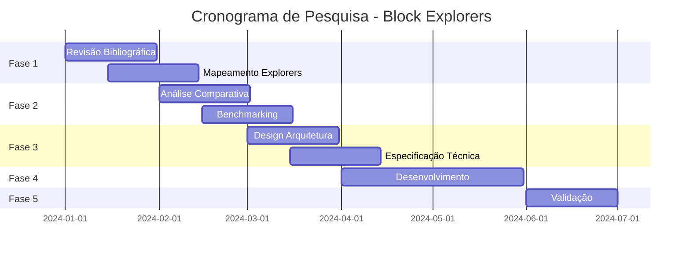

# Metodologia de Pesquisa - Block Explorers

## 1. Abordagem Metodológica

**Tipo**: Pesquisa Exploratória com Análise Comparativa
**Natureza**: Quantitativa e Qualitativa
**Objetivo**: Mapear estado da arte e identificar lacunas de pesquisa

### 2. Estratégia de Coleta de Dados

#### 2.1 Revisão Bibliográfica Sistemática
- **Fonte**: IEEE Xplore, ACM Digital Library, arXiv, Google Scholar
- **Período**: 2015-2024
- **Palavras-chave**: "blockchain explorer", "block explorer", "blockchain indexer", "Web3 explorer"
- **Critérios de Inclusão**: Artigos em inglês, foco técnico, implementações reais

#### 2.2 Análise Comparativa de Explorers
- **Método**: Análise de Arquitetura de Software
- **Ferramentas**: Diagramas UML, análise de código fonte
- **Métricas**: Performance, escalabilidade, segurança, usabilidade

#### 2.3 Desenvolvimento Experimental
- **Metodologia**: Design Science Research (DSR)
- **Fases**: Problem Identification → Solution Design → Development → Evaluation
- **Validação**: Testes empíricos com testnet real

### 3. Framework de Análise

#### 3.1 Dimensões de Análise

| Dimensão | Critérios | Métricas |
|----------|-----------|----------|
| **Arquitetura** | Modularidade, Escalabilidade, Manutenibilidade | Complexidade ciclomática, Acoplamento |
| **Performance** | Latência, Throughput, Uso de Recursos | Tempo de resposta, CPU/Memory usage |
| **Segurança** | Autenticação, Autorização, Integridade | Vulnerabilidades, Rate limiting |
| **Usabilidade** | Interface, Navegação, Acessibilidade | Heurísticas de Nielsen, Acessibilidade WCAG |
| **Interoperabilidade** | Padrões, APIs, Integração | Compatibilidade, Documentação |

#### 3.2 Taxonomia de Block Explorers

```
Block Explorers
├── Por Arquitetura
│   ├── Monolíticos (Etherscan)
│   ├── Microserviços (BlockScout)
│   └── Serverless (Big Dipper)
├── Por Tecnologia
│   ├── EVM-based (Ethereum, Polygon)
│   ├── Cosmos-based (Tendermint)
│   ├── Substrate-based (Polkadot)
│   └── Custom (Solana, Near)
├── Por Licenciamento
│   ├── Open Source (BlockScout, Big Dipper)
│   ├── Proprietário (Etherscan, Mintscan)
│   └── Híbrido (Subscan)
└── Por Escopo
    ├── Single-chain
    ├── Multi-chain
    └── Cross-chain
```

### 4. Protocolo de Pesquisa

#### Fase 1: Descoberta e Mapeamento (Semanas 1-4)
- **Atividade 1.1**: Revisão bibliográfica sistemática
- **Atividade 1.2**: Mapeamento de explorers existentes
- **Atividade 1.3**: Análise de arquiteturas
- **Entregável**: Relatório de estado da arte

#### Fase 2: Análise Comparativa (Semanas 5-8)
- **Atividade 2.1**: Análise técnica detalhada
- **Atividade 2.2**: Benchmarking de performance
- **Atividade 2.3**: Avaliação de UX/UI
- **Entregável**: Análise comparativa completa

#### Fase 3: Design e Arquitetura (Semanas 9-12)
- **Atividade 3.1**: Definição de requisitos
- **Atividade 3.2**: Design da arquitetura
- **Atividade 3.3**: Especificação técnica
- **Entregável**: Documento de arquitetura

#### Fase 4: Implementação (Semanas 13-20)
- **Atividade 4.1**: Desenvolvimento do indexer
- **Atividade 4.2**: Desenvolvimento da API
- **Atividade 4.3**: Desenvolvimento do frontend
- **Entregável**: Protótipo funcional

#### Fase 5: Validação e Avaliação (Semanas 21-24)
- **Atividade 5.1**: Testes de integração
- **Atividade 5.2**: Testes de performance
- **Atividade 5.3**: Avaliação de usabilidade
- **Entregável**: Relatório de validação

### 5. Critérios de Qualidade

#### 5.1 Validade Científica
- **Validade Interna**: Controle de variáveis, replicabilidade
- **Validade Externa**: Generalização dos resultados
- **Validade de Construto**: Medição precisa dos conceitos

#### 5.2 Confiabilidade
- **Consistência**: Resultados reproduzíveis
- **Estabilidade**: Medições consistentes ao longo do tempo
- **Precisão**: Margem de erro aceitável

### 6. Ferramentas de Pesquisa

#### 6.1 Análise de Código
- **SonarQube**: Análise de qualidade de código
- **CodeClimate**: Métricas de complexidade
- **GitHub Insights**: Análise de contribuições

#### 6.2 Testes de Performance
- **JMeter**: Testes de carga
- **K6**: Testes de performance
- **Lighthouse**: Análise de performance web

#### 6.3 Análise de UX
- **Hotjar**: Heatmaps e gravações
- **Google Analytics**: Métricas de uso
- **UserTesting**: Testes de usabilidade

### 7. Ética em Pesquisa

#### 7.1 Princípios Éticos
- **Respeito**: Autonomia dos participantes
- **Beneficência**: Maximizar benefícios, minimizar riscos
- **Justiça**: Distribuição equitativa de benefícios

#### 7.2 Privacidade e Segurança
- **Anonimização**: Dados pessoais protegidos
- **Consentimento**: Participação voluntária
- **Transparência**: Divulgação clara dos objetivos

### 8. Limitações e Riscos

#### 8.1 Limitações Metodológicas
- **Viés de Seleção**: Explorers analisados podem não representar o universo
- **Viés Temporal**: Tecnologias evoluem rapidamente
- **Viés de Acesso**: Código proprietário pode limitar análise

#### 8.2 Riscos Técnicos
- **Dependências**: Mudanças em APIs externas
- **Escalabilidade**: Limitações de recursos computacionais
- **Segurança**: Vulnerabilidades em sistemas de teste

### 9. Disseminação de Resultados

#### 9.1 Artigos Científicos
- **Conferências**: IEEE Blockchain, ACM Web3
- **Periódicos**: IEEE Transactions, ACM Computing Surveys
- **Repositórios**: arXiv, ResearchGate

#### 9.2 Documentação Técnica
- **GitHub**: Código fonte e documentação
- **Medium**: Artigos técnicos
- **YouTube**: Tutoriais e demonstrações

### 10. Cronograma de Execução



---

*Este framework serve como base metodológica para toda a pesquisa científica do projeto TCC Explorer.*
