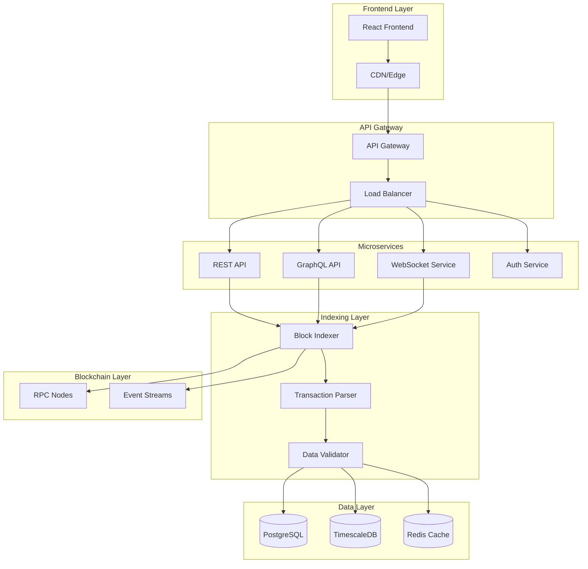
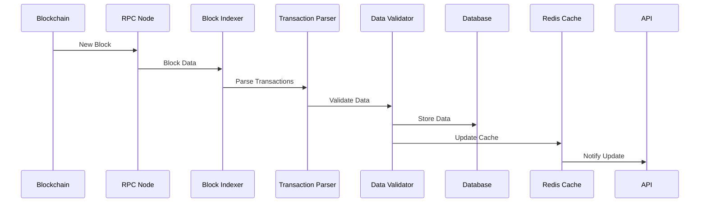
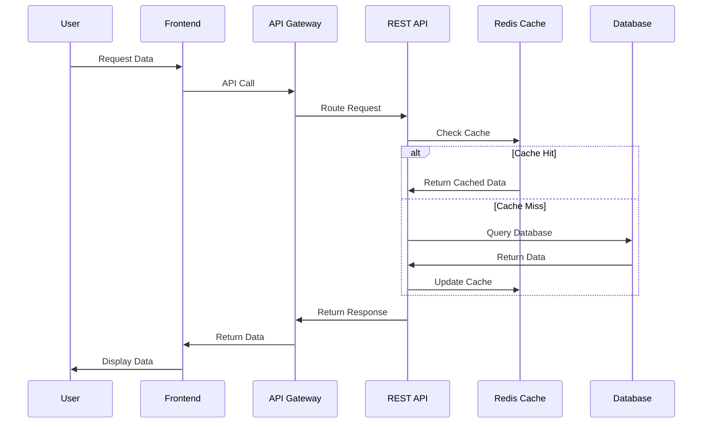

# Arquitetura de Referência para Block Explorers

## Visão Geral

O TCC Explorer foi projetado seguindo os princípios de **microserviços**, **escalabilidade horizontal** e **alta disponibilidade**, baseado na análise comparativa dos principais block explorers existentes.

## Arquitetura de Alto Nível

## Componentes Principais

### 1. Frontend Layer

#### React Frontend
- **Framework**: React 18 + TypeScript
- **State Management**: Redux Toolkit + RTK Query
- **UI Library**: Material-UI + Custom Components
- **Routing**: React Router v6
- **Build**: Vite + SWC

#### CDN/Edge
- **Provider**: Cloudflare
- **Features**: Global distribution, caching, DDoS protection
- **Optimization**: Image optimization, compression, minification

### 2. API Gateway

#### API Gateway
- **Technology**: Kong + OpenResty
- **Features**: Rate limiting, authentication, routing
- **Monitoring**: Prometheus metrics, Grafana dashboards

#### Load Balancer
- **Technology**: HAProxy + Keepalived
- **Features**: Health checks, failover, SSL termination
- **Configuration**: Round-robin with health-based routing

### 3. Microservices

#### REST API Service
- **Language**: Rust + Actix-web
- **Features**: CRUD operations, search, filtering
- **Database**: PostgreSQL with connection pooling
- **Cache**: Redis for frequently accessed data

#### GraphQL API Service
- **Language**: Rust + Juniper
- **Features**: Flexible queries, real-time subscriptions
- **Database**: PostgreSQL with optimized queries
- **Cache**: Redis for query result caching

#### WebSocket Service
- **Language**: Rust + Tokio
- **Features**: Real-time updates, live data streaming
- **Protocol**: WebSocket with JSON messages
- **Scaling**: Horizontal scaling with Redis pub/sub

#### Authentication Service
- **Language**: Rust + JWT
- **Features**: User management, API keys, rate limiting
- **Storage**: PostgreSQL for user data
- **Security**: bcrypt for password hashing

### 4. Indexing Layer

#### Block Indexer
- **Language**: Rust + Tokio
- **Features**: Real-time blockchain monitoring, data extraction
- **Database**: PostgreSQL with TimescaleDB extension
- **Performance**: Async processing, batch operations

#### Transaction Parser
- **Language**: Rust + Serde
- **Features**: Transaction decoding, smart contract analysis
- **Database**: PostgreSQL for parsed data
- **Cache**: Redis for parsing results

#### Data Validator
- **Language**: Rust + Custom validators
- **Features**: Data integrity checks, consistency validation
- **Database**: PostgreSQL with constraints
- **Monitoring**: Prometheus metrics for validation errors

### 5. Data Layer

#### PostgreSQL
- **Version**: PostgreSQL 15+
- **Extensions**: TimescaleDB, PostGIS, pg_stat_statements
- **Configuration**: Optimized for read-heavy workloads
- **Backup**: Continuous archiving with WAL-E

#### TimescaleDB
- **Purpose**: Time-series data storage
- **Features**: Automatic partitioning, compression, retention
- **Use Cases**: Transaction history, block metrics, performance data

#### Redis Cache
- **Version**: Redis 7+
- **Configuration**: Cluster mode for high availability
- **Features**: Pub/sub, Lua scripts, persistence
- **Use Cases**: API response caching, session storage, real-time data

### 6. Blockchain Layer

#### RPC Nodes
- **Technology**: Multiple blockchain clients
- **Features**: Load balancing, failover, monitoring
- **Configuration**: Connection pooling, timeout handling

#### Event Streams
- **Technology**: WebSocket connections
- **Features**: Real-time event processing, filtering
- **Configuration**: Async processing, error handling

## Fluxo de Dados

### 1. Indexação de Blocos

### 2. Consulta de Dados

## Padrões Arquiteturais

### 1. Microserviços

#### Princípios
- **Single Responsibility**: Cada serviço tem uma responsabilidade específica
- **Loose Coupling**: Serviços independentes com interfaces bem definidas
- **High Cohesion**: Funcionalidades relacionadas agrupadas

#### Implementação
- **Service Mesh**: Istio para comunicação entre serviços
- **API Gateway**: Kong para roteamento e autenticação
- **Service Discovery**: Consul para descoberta de serviços

### 2. Event-Driven Architecture

#### Eventos Principais
- **BlockAdded**: Novo bloco indexado
- **TransactionProcessed**: Transação processada
- **DataUpdated**: Dados atualizados
- **ErrorOccurred**: Erro no processamento

#### Implementação
- **Event Bus**: Redis pub/sub
- **Event Store**: PostgreSQL para persistência
- **Event Handlers**: Serviços assíncronos

### 3. CQRS (Command Query Responsibility Segregation)

#### Commands (Escrita)
- **IndexBlock**: Indexar novo bloco
- **ProcessTransaction**: Processar transação
- **UpdateData**: Atualizar dados

#### Queries (Leitura)
- **GetBlock**: Obter dados do bloco
- **SearchTransactions**: Buscar transações
- **GetAccount**: Obter dados da conta

### 4. API-First Design

#### REST API
- **Endpoints**: RESTful com versionamento
- **Documentation**: OpenAPI 3.0
- **Testing**: Contract testing com Pact

#### GraphQL API
- **Schema**: Schema-first development
- **Resolvers**: Resolvers otimizados
- **Subscriptions**: Real-time updates

## Segurança

### 1. Autenticação e Autorização

#### JWT Tokens
- **Algorithm**: RS256 (RSA)
- **Expiration**: 1 hour access, 30 days refresh
- **Claims**: User ID, roles, permissions

#### API Keys
- **Format**: UUID v4
- **Rate Limiting**: Per-key limits
- **Monitoring**: Usage tracking and alerts

### 2. Rate Limiting

#### Estratégias
- **IP-based**: Limite por endereço IP
- **User-based**: Limite por usuário autenticado
- **API Key-based**: Limite por chave de API

#### Implementação
- **Redis**: Contador distribuído
- **Sliding Window**: Janela deslizante
- **Burst Allowance**: Permissão de rajadas

### 3. Data Protection

#### Encryption
- **At Rest**: AES-256 encryption
- **In Transit**: TLS 1.3
- **Keys**: AWS KMS for key management

#### Privacy
- **Data Anonymization**: Técnicas de anonimização
- **GDPR Compliance**: Conformidade com regulamentações
- **Audit Logs**: Logs de auditoria completos

## Monitoramento e Observabilidade

### 1. Métricas

#### Application Metrics
- **Response Time**: Latência das APIs
- **Throughput**: Requests por segundo
- **Error Rate**: Taxa de erros
- **Availability**: Tempo de atividade

#### Infrastructure Metrics
- **CPU Usage**: Uso de CPU
- **Memory Usage**: Uso de memória
- **Disk Usage**: Uso de disco
- **Network**: Tráfego de rede

### 2. Logging

#### Structured Logging
- **Format**: JSON com campos estruturados
- **Levels**: ERROR, WARN, INFO, DEBUG
- **Context**: Request ID, user ID, service name

#### Log Aggregation
- **ELK Stack**: Elasticsearch, Logstash, Kibana
- **Centralized**: Logs centralizados
- **Search**: Busca e análise de logs

### 3. Tracing

#### Distributed Tracing
- **Technology**: Jaeger
- **Spans**: Operações individuais
- **Traces**: Fluxo completo de requisições
- **Context**: Propagação de contexto

## Configuração e Deploy

### 1. Containerização

#### Docker
- **Multi-stage**: Builds otimizados
- **Base Images**: Alpine Linux
- **Security**: Non-root users, minimal packages

#### Docker Compose
- **Development**: Ambiente de desenvolvimento
- **Testing**: Ambiente de testes
- **Local**: Execução local

### 2. Orquestração

#### Kubernetes
- **Deployments**: Deployments para cada serviço
- **Services**: Services para comunicação
- **Ingress**: Ingress para roteamento externo
- **ConfigMaps**: Configurações
- **Secrets**: Dados sensíveis

#### Helm Charts
- **Templates**: Templates reutilizáveis
- **Values**: Configurações por ambiente
- **Dependencies**: Dependências entre charts

### 3. CI/CD

#### GitHub Actions
- **Build**: Build automático
- **Test**: Testes automatizados
- **Deploy**: Deploy automático
- **Security**: Scans de segurança

#### GitOps
- **ArgoCD**: Deploy declarativo
- **Git**: Source of truth
- **Automation**: Deploy automático

## Escalabilidade

### 1. Horizontal Scaling

#### Microserviços
- **Stateless**: Serviços sem estado
- **Load Balancing**: Balanceamento de carga
- **Auto-scaling**: Escalamento automático

#### Database
- **Read Replicas**: Réplicas de leitura
- **Sharding**: Particionamento de dados
- **Connection Pooling**: Pool de conexões

### 2. Performance Optimization

#### Caching
- **Redis**: Cache distribuído
- **CDN**: Cache de conteúdo
- **Application Cache**: Cache de aplicação

#### Database Optimization
- **Indexes**: Índices otimizados
- **Query Optimization**: Otimização de queries
- **Connection Pooling**: Pool de conexões

## Estratégia de Testes

### 1. Unit Tests
- **Coverage**: 80%+ cobertura
- **Framework**: Rust: cargo test, Node: Jest
- **Mocking**: Mocks para dependências

### 2. Integration Tests
- **Database**: Testes com banco real
- **APIs**: Testes de endpoints
- **Services**: Testes de integração

### 3. End-to-End Tests
- **User Flows**: Fluxos completos
- **Browser**: Testes com browser real
- **Performance**: Testes de performance

## Próximos Passos

### 1. Implementação
- [ ] Configuração do ambiente de desenvolvimento
- [ ] Implementação dos microserviços básicos
- [ ] Configuração do banco de dados
- [ ] Implementação da API REST

### 2. Testes
- [ ] Testes unitários
- [ ] Testes de integração
- [ ] Testes de performance
- [ ] Testes de segurança

### 3. Deploy
- [ ] Configuração do Kubernetes
- [ ] Configuração do CI/CD
- [ ] Deploy em ambiente de produção
- [ ] Monitoramento e alertas

---

*Esta arquitetura serve como base para todo o desenvolvimento do TCC Explorer, garantindo escalabilidade, manutenibilidade e performance.*
